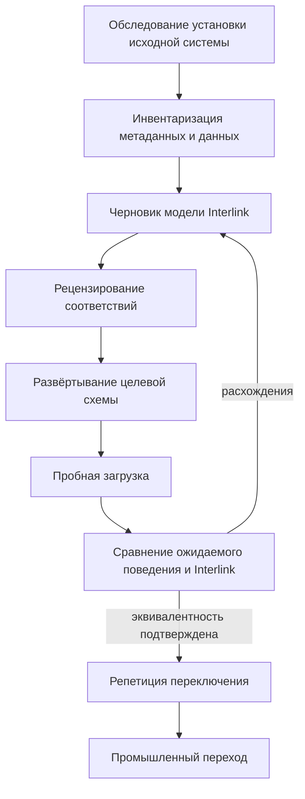

<!-- Generated from wiki/Data-migration-strategy.md. Edit the source, then run tools/Build-Book.ps1. -->

# Стратегия миграции существующей базы данных

## Миграция — не копирование таблиц

При переносе нельзя заранее считать, что одинаково названные таблицы, версии или статусы имеют одинаковый смысл в исходной системе и Interlink. Прямого копирования строк может быть недостаточно. Миграция начинается с обследования конкретной установки: типов, атрибутов, связей, версий, правил, справочников, локальных расширений и обработчиков. Участники перехода определяют, куда перенести данные и какие действия пользователей после перехода обязаны давать согласованный результат.

Набор переносимых понятий зависит от источника. Если в нём нет инженерных версий, итераций или истории отдельных полей, миграция не должна придумывать их задним числом. Доступные сведения переносятся с указанием происхождения; неизвестное остаётся явно обозначенным пробелом. Необходимые новые правила работы согласуются отдельно от сохранения исторических данных.

Цель перехода — не воспроизвести старое устройство базы, а доказуемо перенести:

- идентичность объектов и документов;
- пользовательские версии, их опубликованное содержание и значимую рабочую историю;
- составы и связи;
- значения и их области;
- справочники и настройки предприятия;
- значимые состояния и применяемость;
- файлы и архивные свидетельства;
- происхождение и необходимые права;
- функциональные сценарии пользователей.

Здесь описан **целевой процесс перехода**, а не готовая автоматическая конвертация. В частности, наличие средств проверки модели и создания таблиц Interlink ещё не означает готовности средства импорта, пользовательских рабочих мест и промышленного переключения.

## Этап 1. Зафиксировать границы установки исходной системы

Нельзя мигрировать абстрактную систему. Нужно зафиксировать версию продукта, СУБД, установленные модули, объём данных, локальные типы, конфигурацию жизненного цикла, интеграции и внешние обработчики.

Отдельно выявляются:

- метаданные, поставленные производителем;
- метаданные предприятия;
- атрибуты, вынесенные в отдельное хранение для конкретных типов;
- произвольные расширения;
- формы и правила, содержащие предметную логику;
- данные, чья целостность держится только кодом;
- устаревшие или больше не используемые определения;
- отличия промышленной, испытательной и разработческой баз.

Результат — паспорт источника и список неопределённостей. Без него сравнение производительности и полноты не имеет смысла.

## Этап 2. Извлечь метамодель

Для выбранного источника планируется средство извлечения описаний типов и связей с подготовкой черновика модели на предметном языке Interlink — DSL. Возможность и полнота извлечения зависят от интерфейсов источника и проверяются отдельно. Черновик не переносит данные самих изделий и не становится действующей моделью автоматически: специалистам предстоит проверить смысл определений и поведение на примерах.

Для каждого определения фиксируются:

- глобальные и локальные идентификаторы, если они существуют, их формат, область уникальности и правила повторного использования;
- наименование и иерархия;
- версионность;
- атрибуты, их типы, многозначность и область;
- допустимые связи и ограничения числа участников;
- физические срезы и индексы;
- жизненный цикл и уровни;
- локальные формы, обработчики и правила;
- предполагаемый модуль и уровень владения Interlink.

## Этап 3. Построить карту соответствий

Особенно важно различить четыре понятия: объект «Корпус редуктора», его пользовательскую версию «Б», точное опубликованное содержание этой версии и незавершённую рабочую правку. Одна версия может получать новые опубликованные состояния без смены своего обозначения. Сохранение черновика или возврат его к прежнему содержанию сами по себе ничего не публикуют.

| Данные исходной системы | Представление в Interlink | Особое решение |
|---|---|---|
| Тип объекта | Определение типа в модуле Interlink | Уточнить назначение, свойства и правила изменения |
| Объект и его версии | Устойчивый объект и самостоятельные пользовательские версии | Не превращать версии в разные изделия |
| Опубликованное содержание версии | Неизменяемое состояние этой версии | Сохранить точное содержание и доступное доказательство публикации |
| Рабочая копия и промежуточные итерации | Черновик, точка восстановления либо отдельное историческое свидетельство | Не объявлять незавершённую работу опубликованной |
| Тип связи | Типизированное отношение | Уточнить, связаны объекты, версии или точные состояния |
| Структурная связь | Позиция состава с правилами выбора содержимого | Сохранить место использования, количество и область конкретизации |
| Атрибут | Свойство с явным владельцем | Различить свойства объекта, содержания версии и конкретного использования |
| Многозначный атрибут | Набор значений владельца | Сохранить порядок и дубликаты, если они значимы |
| Ссылка на объект/версию | Ссылка соответствующего смысла | Выбор версии и фиксация точного состояния не взаимозаменяемы |
| Справочник | Список значений, каталог объектов или табличный набор — по исходному смыслу | Сохранить устойчивые коды, свойства, действующие редакции и правила поиска |
| Уровень продвижения | Степень готовности | Не смешивать с маршрутом согласования |
| Форма/обработчик | Принимающий продукт или предметный модуль | Не переносить исполняемую логику как данные |

Карта включает не только данные, но и решение «что не переносится». Устаревший тип может остаться в архивном контуре, а не становиться частью новой активной модели.

Для жёсткой конкретизации сохраняется выбранная **пользовательская версия**, если именно это означает исходная настройка. Нельзя незаметно усилить её до фиксации содержания на день переноса: тогда будущая правка той же версии перестанет появляться там, где пользователь ожидает её увидеть. Для мягкой конкретизации дополнительно нужны конкретная позиция, область действия и правила снятия и восстановления при переходах жизненного цикла. Одно общее предпочтение на весь объект этого не заменяет.

Карта должна охватить и новые подробно описанные области: табличные справочники, многомерные соответствия, полные комплекты замен и матрицы совместимости. Например, замену двух деталей на три нельзя разбить на независимые пары, а пустую клетку справочника нельзя превратить в нулевое значение или автоматический запрет. Сначала устанавливается исходный смысл, затем выбирается представление Interlink.

## Этап 4. Определить стратегию идентичности

У каждого предметного объекта Interlink есть устойчивый переносимый идентификатор. Если у источника есть совместимый глобально уникальный идентификатор, его можно сохранить при подтверждённом происхождении и отсутствии конфликта. Иначе назначается идентификатор Interlink и сохраняется явное соответствие исходному ключу. Совпавшее обозначение детали или имя файла не доказывают тождество.

Для версий и их содержания создаются целевые адреса Interlink, а соответствие с исходными записями сохраняется в реестре переноса. Этот реестр различает исходную установку, объект, версию, состояние и рабочую итерацию. Повтор загрузки не должен создавать ещё одну копию уже перенесённой версии.

Локальные числовые ключи, если они используются источником, не становятся вторым внутренним ключом Interlink. Они сохраняются в таблице внешних соответствий или как бизнес-атрибут при реальной потребности.

## Этап 5. Очистить и классифицировать данные

Часть целостности исходной системы может обеспечиваться прикладной логикой, а локальные расширения — иметь собственные правила. Поэтому до загрузки нужно проверить фактические данные, даже если они давно используются на предприятии:

- ссылки на отсутствующие объекты;
- значения неизвестного типа;
- дубли устойчивых номеров;
- несовместимые пары объекта и версии;
- связи с недопустимыми концами;
- конфликтующие назначения основной версии в одной области, если её правила требуют единственного выбора;
- значения вне справочника;
- расхождения общего и отдельного хранения атрибутов типа;
- осиротевшие файлы и снимки.

Для каждого класса задаётся политика: исправить в исходной системе, преобразовать при переходе, загрузить в карантин или исключить с подписанным отчётом.

## Этап 6. Сформировать целевые модули

Рекомендуется разделить:

- базовые типы Interlink;
- модуль покрытия обязательных сценариев исходной системы;
- предметные модули предприятия;
- временный миграционный модуль соответствий;
- функции принимающего продукта: формы, права, процессы, интеграции;
- архивный модуль для истории, не участвующей в новых операциях.

Так локальная специфика не смешивается с ядром, а последующее обновление становится управляемым.

Согласованное описание проходит проверку и включается в подготовленный пакет модели вместе с точными зависимостями, правилами перехода и средствами чтения истории. В испытательную, а затем в промышленную базу устанавливается именно этот проверенный пакет. Нельзя разрешать приложению работу лишь потому, что описание модели успешно прочитано или таблицы уже созданы: требуется доказать соответствие пакета фактическому состоянию базы.

## Стратегии перехода

### Одномоментное переключение

Запись в согласованной области исходной системы останавливается, переносятся последние изменения после исходного среза, выполняются проверки, затем право записи передаётся Interlink. Подходит при допустимом окне обслуживания и ограниченном числе интеграций. Если проверка не пройдена, переключение не состоялось; наличие загруженных данных ещё не даёт права принимать новые производственные изменения.

### Поэтапный переход по предметным областям

Сначала переводится, например, справочник материалов, затем документы и изделия. Для каждой области должен быть один авторитетный владелец. Двойная запись без строгого договора запрещена.

### Сопровождающий режим

Исходная система остаётся владельцем, Interlink хранит наблюдения или импортную проекцию для проверки новых функций. Это полезно для Alvatune и опытной эксплуатации, но не считается завершённой миграцией.

Если в сопровождающем режиме потребуется обратная запись в исходной системе, её выполняют принимающий продукт и специальный соединитель, а не фоновая логика Interlink. Намерение, внешний номер операции и точное содержание сообщения надёжно сохраняются до отправки; полномочия проверяются и перед фактическим обращением к исходной системе. Если ответ потерян, исход считается неизвестным. Без заранее проверенной защиты от повторного выполнения нужно сначала установить результат в исходной системе; слепая повторная отправка недопустима. Полный рабочий договор описан на странице [Как продуктовые специалисты участвуют в переносе существующих данных](Data-migration-operating-model.md).

## Пример 1. Атрибут материала в двух путях исходной системы

Для корпуса насоса материал найден в двух местах хранения исходной системы: карточка показывает сталь 20Л, а подготовленный отчёт — 25Л. Команда переноса не выбирает более позднее значение автоматически. Технолог вместе с владельцем данных выясняет, какой путь является действующим, и проверяет чертёж и правила отчёта. После решения материал переносится как одна проверяемая ссылка на справочник. Пользователь получает понятный отчёт об исправлении; неразобранные корпуса остаются в карантине.

## Пример 2. Объект и версия детали

У корпуса редуктора есть версии «А» и «Б». Для «Б» сохранены два опубликованных состояния и последующая рабочая правка толщины стенки. Перенос сохраняет один объект, две пользовательские версии, доступную историю опубликованного содержания и отдельную незавершённую работу. Заказ, переданный до изменения толщины, должен открывать прежнее точное содержание, а инженер — продолжить черновик. Нельзя ни создать пять разных корпусов, ни объявить последнюю рабочую правку действующей публикацией.

## Пример 3. Пользовательский тип оснастки

На инструментальном заводе «Приспособление для расточки корпуса» — локальный тип исходной системы с допустимым диаметром, связью с операцией и особой нумерацией. Тип и его данные включаются в модуль предприятия. Форма работы и выдача номера относятся к принимающему продукту. На пробном переносе технолог проверяет не только карточку, но и поиск подходящих приспособлений, историю чертежей и запрет использования снятой с эксплуатации оснастки. Наличие перенесённых полей не закрывает эти сценарии автоматически.

## Пример 4. Исторические итерации

По гидроцилиндру сохранились десять промежуточных итераций, но поставщику был отправлен чертёж из одной конкретной итерации. Для неё необходимо сохранить именно отправленный файл и его доступное основание. Остальные итерации классифицируются как точки восстановления либо архивная рабочая история. Если источник не сохранил подтверждение отправки или старое содержимое файла, отчёт переноса указывает, какие файлы или подтверждения отсутствуют, а не воссоздаёт исторический документ по сегодняшнему шаблону.

## Открытые вопросы

- Какая целевая версия и конфигурация исходной системы мигрируется первой?
- Какой глобальный идентификатор исходной системы можно принять как целевую идентичность без преобразования?
- Сколько локальных обработчиков содержит предметную логику?
- Какие итерации и журналы должны остаться оперативно читаемыми?
- Какое окно остановки допустимо?
- Возможен ли юридически значимый архив только для чтения?
- Какие интеграции должны переключиться одновременно?

## Критерии готовности стратегии

1. Зафиксирован паспорт источника.
2. Каждое активное определение исходной системы имеет решение о целевом месте.
3. Есть карта идентичностей и областей атрибутов.
4. Все классы дефектных данных имеют политику.
5. Выбран один владелец каждого набора данных на каждом этапе.
6. Формы и обработчики отделены от переносимой предметной модели.
7. Определены сценарии доказательства эквивалентности.
8. Жёсткая и мягкая конкретизация проверены не только в день переноса, но и после последующих изменений и переходов жизненного цикла.
9. Зафиксированы правила переноса последних изменений исходной системы, переключения владельца записи и возврата с учётом новых данных Interlink.

## Состояние реализации

Стратегия соответствует целевому контракту, актуализированному в сентябре 2026 года. Существуют строительные блоки проверки модели, сравнения её редакций и формирования плана. Это не готовый промышленный конвейер установки и не загрузчик исходной системе. Средства обследования, переноса, карантина, сравнительной проверки и переключения ещё предстоит реализовать и подтвердить на конкретной установке. Первая миграция должна включать предметное рецензирование и несколько полных репетиций.

## Связанные документы

- [Выполнение и доказательство миграции](Data-migration-execution.md)
- [Архитектурные решения](Data-architecture-decisions.md)
- [Предметный язык модели и устойчивые определения](Data-model-language.md)
- [Табличные справочники](Reference-tables.md)
- [Допустимые замены и комплекты](Allowed-replacements.md)
- [Матрицы совместимости](Compatibility-matrices.md)
