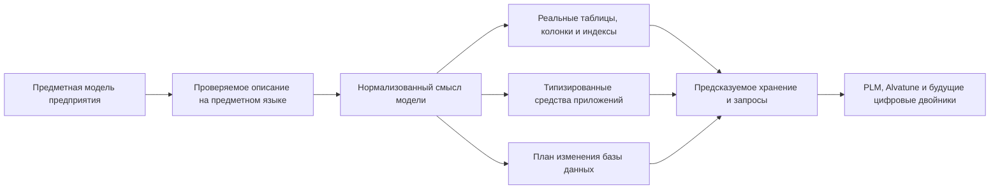

# Система типов и структура данных Interlink

## О чём этот раздел

Этот раздел объясняет, как Interlink превращает предметную модель предприятия в расширяемую, проверяемую и производительную систему хранения инженерных данных. Он предназначен для продуктовых специалистов и экспертов предприятий, архитекторов систем управления жизненным циклом изделия (PLM) и инженерных систем (CAx), руководителей внедрения и специалистов, которым нужно оценить не синтаксис программы, а возможности будущей платформы.

Главная идея проста:

> Модель предприятия проверяется как единое описание. В целевой физической схеме известные типы становятся реальными таблицами PostgreSQL, атрибуты — типизированными столбцами или специализированными таблицами значений, связи — самостоятельными таблицами с ограничениями и индексами. Это позволяет расширять предметную область, сохраняя согласованные правила хранения и работы с данными.

Такой подход сохраняет богатство PLM-моделирования, но переносит значительную часть проверки из позднего выполнения в момент выпуска модели и в саму базу данных. Это создаёт основу для предсказуемых запросов, управляемых обновлений и более высокой параллельной нагрузки — особенно важной при появлении большого числа фоновых процессов и агентов Alvatune.

## Короткий ответ: что получает предприятие

- богатую систему типов для изделий, документов, требований, техпроцессов, заказов, связей и других предметных сущностей;
- отдельное представление устойчивого объекта, инженерной версии, её опубликованного содержания и незавершённой рабочей правки;
- изменяемые оперативные записи и неизменяемые факты там, где инженерные версии не нужны;
- наследование типов, типизированные связи, составы, кортежи, справочники, ссылки, вычисляемые и измеряемые атрибуты;
- предметный язык описания модели — DSL, то есть специализированный язык, понятный как единая декларация модели;
- формирование физических таблиц, ограничений целостности и индексов из модели, с дальнейшим развитием под новые предметные договоры;
- целевые три управляемых уровня расширения: версия поставляемой модели, разрешённая настройка предприятия и типизированное расширение во время работы;
- будущий управляемый процесс миграции базы данных;
- будущую проверку расхождения между моделью, прикладными представлениями и базой;
- возможность собирать единую модель из версионированных предметных модулей;
- фундамент для цифровой нити и экземплярных цифровых двойников.

Главный смысл схемы: таблицы, программные контракты и миграции не проектируются независимо друг от друга. Они являются согласованными результатами одной предметной модели.

## Как сочетаются гибкость и надёжность

Предприятию необходимо добавлять новые типы и признаки без постоянной переделки прикладного ядра. Одновременно нужны надёжные ссылки, понятные ограничения, быстрый поиск и контролируемое обновление рабочих баз. Interlink решает эти задачи через явную модель и управляемое развитие её физического представления.

Основные решения и условия их применения:

| Вопрос | Требование | Решение Interlink |
|---|---|---|
| Где живёт основная модель | Изменения должны быть сравнимы и воспроизводимы | В версионируемом DSL и его проверенной поставке |
| Как хранится известный тип | Данные и их ограничения должны быть явными | В типизированной таблице или согласованной группе таблиц |
| Как проверяется тип значения | Ошибка выявляется до некорректного использования | Компилятором, командным слоем и ограничениями БД |
| Как расширяется предприятие | Локальная настройка не нарушает общий контракт | Через модули, разрешённые настройки и типизированные расширения |
| Как сравниваются среды | Расхождения должны быть обнаружимы | По версии, отпечатку модели, составу модулей и отчёту расхождений |
| Как ускоряются частые обращения к полям | Не появляются независимые источники одного значения | Управляемым переводом расширения в основную колонку |

Промышленные показатели быстродействия Interlink ещё не подтверждены. Выбранная архитектура должна уменьшить конкретные издержки универсального хранения, усилить ссылочную целостность и сделать распространённые запросы более предсказуемыми. Численные границы предстоит проверить нагрузочными испытаниями на закреплённых данных и операциях; большой объём справочников, глубокий состав и частые конкурентные изменения проверяются отдельно.

## Что добавилось в новой архитектуре

Раньше объяснение строилось главным образом вокруг изделия, версии и атрибута. Теперь важно сначала выбрать правильную форму данных. Для конструкции редуктора нужна история инженерных версий и опубликованных состояний. В справочной карточке склада можно изменять контактные реквизиты с проверкой параллельных правок. Результат измерения регистрируется отдельным фактом; исправление сохраняется новой связанной записью. Документ-протокол, составленный по измерениям, имеет собственный порядок подготовки и утверждения. Эти данные используют общие средства типизации, связей и контроля доступа, но различаются правилами изменения.

Табличные данные также больше не сводятся к вложенному файлу или составному объекту. Размерный ряд крепежа хранится как индексируемый набор строк; полная таблица испытаний — как сетка с проверкой каждой заявленной точки; выбор клапана по среде, диаметру и давлению — как карта явно заданных соответствий. Отдельно поверх этих данных описываются разрешённые замены и ограничения совместимости. Пустая клетка карты сама по себе не означает ни запрет, ни разрешение.

Наконец, точность распространяется на основания решения. Для согласованного заказа или действия агента недостаточно сохранить обозначение версии: необходимо удержать использованное содержание, существенные справочники, правила и способ их прочтения. Появление новой, ещё не использованной редакции справочника не переписывает прежний выбор и не отменяет прежнее согласование автоматически. Новая операция проверяется по действующим требованиям к своему назначению.

Продолжение этих тем:

- [[Объектный фундамент без привязки к отрасли|Object-foundation]] и [[примеры за пределами машиностроения|Multidomain-scenarios]];
- [[табличные данные|Tabular-data]], [[инженерные справочники|Reference-tables]], [[многомерные сетки|Multidimensional-tables]] и [[координатные карты|Coordinate-maps]];
- [[допустимые замены|Allowed-replacements]] и [[матрицы совместимости|Compatibility-matrices]];
- [[агенты и прослеживаемость решений|Agents-and-traceability]].

## Материалы раздела

### Замысел и возможности

- [[Почему система типов является основой продукта|Data-type-system-vision]]
- [[Какие предметные конструкции поддерживает модель|Data-type-system-capabilities]]
- [[DSL как язык модели предприятия|Data-model-language]]
- [[Как типы материализуются в физическую базу данных|Data-database-materialization]]
- [[Расширяемость, настройка предприятия и развитие модели|Data-extensibility]]

### Масштаб и переход с существующих систем

- [[Производительность, высокая нагрузка и оркестрация агентов|Data-performance-and-agents]]
- [[Архитектурные решения системы данных|Data-architecture-decisions]]
- [[Стратегия миграции существующей базы данных|Data-migration-strategy]]
- [[Выполнение миграции и доказательство эквивалентности|Data-migration-execution]]

### Рынок и развитие

- [[Архитектурные подходы и компромиссы|Data-design-tradeoffs]]
- [[Развитие в сторону цифровых двойников|Data-digital-twins]]
- [[Сквозные машиностроительные примеры|Data-engineering-examples]]
- [[Состояние реализации, риски и критерии приёмки|Data-status-risks-acceptance]]

### Как модель работает в руках людей

- [[Как изменяется модель предприятия|Data-model-lifecycle]]
- [[Как модель превращается в работающую систему|Data-model-runtime]]
- [[Поиск, выборки и обход связей глазами пользователя|Data-search-and-queries]]
- [[Пакет выпуска модели, установка и обновление|Data-release-and-installation]]
- [[Настройки предприятия и разрешение конфликтов|Data-enterprise-settings]]
- [[Как продуктовые специалисты участвуют в переносе существующих данных|Data-migration-operating-model]]

## С чего начать чтение

Продуктовому специалисту рекомендуется начать со страниц [[Почему система типов является основой продукта|Data-type-system-vision]], [[Как изменяется модель предприятия|Data-model-lifecycle]], [[Как модель превращается в работающую систему|Data-model-runtime]] и [[Как проходит перенос существующих данных|Data-migration-operating-model]]. Архитектору данных полезны документы о возможностях, физическом хранении, выпуске и настройках. Для обсуждения нагрузки и развития важны страницы об агентах, поиске и цифровых двойниках.

## Важная граница готовности

По состоянию пересмотра документации на 6 сентября 2026 года в проекте есть компилятор модели, сборка модулей и генерация типизированных средств приложений. В текущем рабочем коде появились формирование физической схемы PostgreSQL, планирование переходов и проверки каталога модели. Это уже больше, чем только описание языка, но ещё не готовая промышленная установка: полный безопасный путь обновления, исполнения запросов и предметных изменений, а также переход на новые правила версий требуют завершения и сквозной приёмки.

Индексируемые табличные наборы, координатные карты, отношения замен и совместимости, нейтральные формы записей и точные контексты агентов закреплены в целевой архитектуре. Наличие страниц об этих механизмах не означает, что они уже доступны в готовом пользовательском приложении. Актуальные границы собраны в [[карте зрелости и приёмки|Data-status-risks-acceptance]].

Поэтому материалы раздела описывают одновременно реализованный фундамент, принятый целевой контракт и продуктовые преимущества, которые должны быть подтверждены сквозным опытным образцом. В каждом документе статус отделён от целевого обещания.

## Основные источники

- [[Зачем создаётся Interlink|Why-Interlink]]
- [[Предметный язык модели|Model-language]]
- [[Система объектов и данных|Object-model-and-data]]
- [[Расширяемость и миграция|Extensibility-and-migration]]
- [[Отраслевые требования|Domain-requirements]]
- [[Состояние и дорожная карта|Current-state-and-roadmap]]
- [[Как проверяются основания и статусы|Trust-and-sources]]
